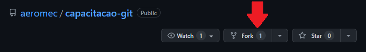
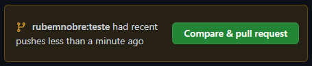

# Capacitação de git para o Avoante Aeromec

## Dia 2

### Setup inicial

1. Configure seu nome de usuário: `git config --global user.name "rubemnobre"`
1. Configure seu email: `git config --global user.name "rubemjrx@hotmail.com"`

### Repositório

O git tem objetivo de gerenciar os arquivos de um projeto, ele consegue armazenar um histórico de alterações e gerenciar versões paralelas (branches), entre outras funções.
Um repositório é um envólucro para um projeto.

#### Inicializando um repositório

##### Do zero

1. Crie uma pasta no local onde deseja:
    1. Navegue para o local utilizando `cd`
    1. Crie a pasta utilizando `mkdir`
    1. Navegue até a pasta utilizando `cd`
1. Inicialize o repositório utilizando o comando `git init`
1. Você já pode começar a utilizar o repositório.

##### Em um projeto já iniciado

1. Navegue até a pasta onde o projeto está utilizando `cd`
1. Inicialize o repositório utilizando o comando `git init`

#### Clonando um repositório

1. Copie o link do repositório. Exemplo: o link deste repositório é [https://github.com/rubemnobre/capacitacao-git](https://github.com/aeromec/capacitacao-git).
1. Navegue até a pasta onde quer colocar o repositório utilizando `cd`
1. Clone o relatório utilizando o comando `git clone https://link.do.repositorio/`

### Commit

Já foi dito que o git é capaz de armazenar o histórico de alterações de um projeto. Os pontos na história que são armazenados são os commits.

#### Status

Para ver as alterações desde o último commit, utilize o comando `git status`

Ele irá listar quais arquivos foram modificados desde o último commit.

#### Add

Para adicionar os arquivos modificados ou criados ao commit, utilize o comando `git add arquivo.txt` para cada arquivo listado em vermelho ("Untracked files" e "Changes not staged for commit") pelo comando `git status`. Se sentir segurança de que não há nenhum arquivo indesejado na pasta, utilize `git add .`, que adicionará todos os arquivos dela.

#### Fazer o commit

Cada commit tem uma etiqueta com data, hora, quem fez, e um comentário que o descreve. Quando for fazer um commit, pense bem nas atualizações que fez e monte uma frase curta que as descreva.
Para fazer o commit: `git commit -m "adicionar funcionalidade de desistir do projeto"`

### Branches

Você pode criar uma versão paralela do projeto, podendo alterá-lo sem modificar a versão principal e, após finalizar as alterações, emergir as versões, gerando atualizações com segurança. O nome dado para uma versão é *branch*. Outra função de uma branch é separar o trabalho por programador ou equipe, cada programador desenvolvendo uma parte do código tem sua própria branch.

#### Criando uma branch

Utilize o comando `git branch nome_da_branch`

#### Utilizando a branch nova

Utilize o comando `git checkout nome_da_branch`

Dentro desta branch, você pode fazer qualquer commit sem alterar as outras branches.

#### Emergindo branches

Utilize o `git checkout main` para retornar à branch principal (você pode fazer isso a qualquer momento, mesmo que não for fazer um merge).

Utilize o comando `git merge nome_da_branch`. Você verá informações de quais arquivos foram atualizados.

Merges não precisam acontecer entre uma branch secundária e a main. Eles podem ser feitos entre quaisquer duas branches, desde que faça sentido.

##### Conflitos de merge

Se as branches tiverem edições concorrentes em algum ponto, o git não vai conseguir realizar o merge, e ficará ao critério do usuário resolver o conflito. O git destacará os conflitos e basta resolvê-los e utilizar `git add` e `git commit` para tornar as correções permantentes.

### Remotes

Os repositórios de git de um projeto podem ser armazenados em um servidor remoto. Em boa parte dos casos, o GitHub fornece esta funcionalidade.
Quando um repositório é clonado do GitHub, a configuração do servidor remoto é feita automaticamente, então podemos pular a primeira secção deste capítulo.

Para listar os remotes de um repositório, utilize o comando `git remote`. Por padrão, os remotes do GitHub são chamados `origin`.

#### Adicionando um remote ao repositório já existente

Crie um repositório no GitHub para conter seu projeto e copie o link dele. Ex.: [https://github.com/rubemnobre/eater-emulator](https://github.com/rubemnobre/eater-emulator).

Utilize o comando `git remote add nome_do_remote link_do_remote`. Ex.: `git remote add origin https://github.com/aeromec/MDO-Aero/`.

#### Atualizando o remote

Utilize o comando `git push nome_do_remote nome_da_branch`. Ex.: `git push origin main`.

#### Baixando atualizações do remote

Utilize o comando `git pull`

Se as atualizações contidas no remote forem incompatíveis com o que está na sua máquina, você receberá uma mensagem de erro indicando qual é a incompatibilidade. Por isso, devemos ser cuidadosos com quais branches cada programador está editando e não criarmos modificações concorrentes.

Em último caso, faça o push de suas branches e volte para o diretório que contém o repositório, delete a pasta e refaça o `git clone`.

### Forks e Pull Requests

Para contribuir com um projeto de terceiros, você pode criar um fork do projeto: uma cópia pessoal dele.

Assim, você criará um repositório no seu perfil com o mesmo nome do original. Faça `git clone` neste repositório e dentro dele, utilize o comando `git remote add upstream link_do_repositorio_original`. Após isso, você pode criar uma nova branch e realizar suas edições nela. Ao realizar o comando `git push -u origin nome_da_nova_branch`, você verá a opção de criar um pull request no repositório original.

